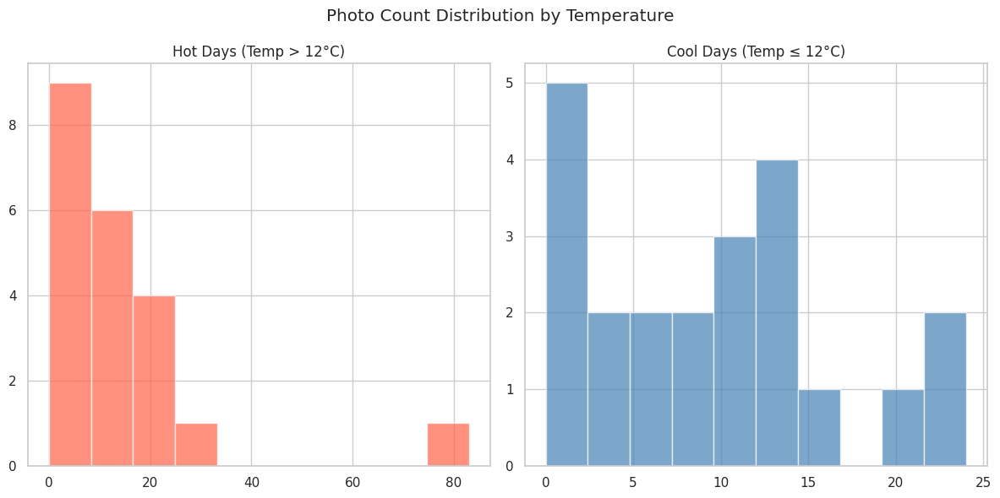

# Weather / Phone Usage Analyse Project
This is the repository that is created for the DSA210 term project of Kerem Karadeniz. In this project it is going to be studied on the relationship between weather conditions and phone usage, supported by my own data. 

# Project Overview
We often hear people say that bad weather keeps them encouraged to use their phones or that a sunny day encourages them to spend more time outdoors. But how true is this? This project aims to find how weather conditions influence my phone usage habits by analyzing factors such as temperature, precipitation, and humidity alongside digital behaviors like screen time, social media engagement, and the number of photos taken daily.
Over the next months, I will collect the data of weather conditions and my phone usage, and I will try to find the correlation between them. 

# Objectives
Exploring the Connection Between Weather and Digital Behavior:
 - Realise how different weather conditions correlate with various aspects of my phone usage.
Identifying Key Influencing Factors:
 - Determine whether specific weather variables (e.g., extreme temperatures, rainy days) are more likely to increase or decrease screen time and phone activity.
Applying the skills that I learned in lecture in order to analyse all these values
 - Finally, I need to conclude by finding the reality to make a thing.

# Motivation
Personal Curiosity:
 - I’ve always wondered whether my phone usage is truly affected by the weather or if it's just a perception. This project will help me find out.
Bringing Data into Daily Life:
 - Instead of relying on assumptions, I want to use data-driven analysis to answer questions about my own habits.
 - Also, the data collection process will help me to be aware of my phone usage.
 - If I discover clear trends in my screen time and phone habits, I can use these insights to make more mindful decisions about technology use.
Applying my newly learned skills for DSA in something real:
 - Practice is really important in order to make my skills long lasting.

# Methodology
Some other factors should be considered while analysing the relationship between weather conditions and phone usage. For instance, the phone itself can encourage me to use it by sending notifications. Or the time I am awake in a single day determines the time I can spend on my phone. Also, sometimes, when I have lots of courses, I won't be able to look at my phone and use it that much. Therefore, I should also have these factors in scope. 

# Data
Weather:
 - Average Temperature
 - Precipitation rate
 - Weather type

Additional Factors:
 - Weekend / Weekday information
 - Number of lectures by day
 - Focus Time
 - Wake up time
 - Sleep time
 - Number of Notifications

Phone Usage:
 - Number of photos taken
 - Social media usage
 - Total screen time

# Example Data Table

Weather & Phone Usage Data

| Date       | Wake Up Time | Sleep Time | Notifications | Social Media (min) | Screen Time (min) | Focus Time (min) | Is_Weekend | Lecture Count | Avg Temperature (°C) | Precipitation Rate (mm) | Weather Type          | Number of Photots taken | Photos Taken Outdoor |
|------------|---------------|-------------|----------------|---------------------|--------------------|-------------------|-------------|----------------|------------------------|--------------------------|------------------------|--------------------------|------------------------|
| 14-03-2025 | 8.2           | 1.10        | 233.0          | 125.0               | 177                | 165.0             | 0           | 5              | 18.9                   | 0.00                     | Partially cloudy       | 20                       | 20                     |
| 15-03-2025 | 11.0          | 0.46        | 69.0           | 150.0               | 116                | 172.0             | 1           | 0              | 19.7                   | 0.00                     | Partially cloudy       | 16                       | 14                     |
| 16-03-2025 | 9.2           | 2.28        | 178.0          | 110.0               | 187                | 219.0             | 1           | 0              | 22.1                   | 0.00                     | Partially cloudy       | 24                       | 20                     |
| 17-03-2025 | 8.2           | 0.12        | 211.0          | 149.0               | 183                | 158.0             | 0           | 8              | 15.6                   | 1.22                     | Rain, Partially cloudy | 26                       | 24                     |
| 18-03-2025 | 8.4           | 0.18        | 492.0          | 181.0               | 133                | 202.0             | 0           | 5              | 6.8                    | 9.45                     | Rain, Partially cloudy | 6                        | 6                      |

# Exploratory Data Analysis (EDA)

In this phase, we began by preprocessing the dataset that includes both weather and personal phone usage information from March 14 to April 25, 2025. After ensuring the dataset was clean and consistent, we carried out various exploratory data analysis steps:

- Converted date formats and ensured proper column naming (e.g., correcting "Number of Photots taken" to "Photos Taken").

- Filled missing values with column-wise mean values to maintain consistency and statistical integrity.

- Created new features such as Time Out Social Media, calculated as the difference between total screen time and time spent on social media.

- Grouped and compared daily behaviors by Is_Weekend and Weather Group (Clean Weather vs Others).

- Visualized correlations among key numerical variables like Notifications, Social Media, Screen Time, Focus Time, Temperature, Precipitation, and photo metrics.
  > 
  
- All refined data has been visualised as graphs. Two samples below:
  > 
  > 

- Plotted bar charts to investigate distribution differences between weekend/weekday and weather groups.
  > 

- Created a scatterplot to analyze the relation between average temperature and number of photos taken.
  > 

- Additional charts were created to compare significant variables from the dataset.
  > 
  > 
  > 

# Hypothesis Testing

We defined three main hypotheses to evaluate using the dataset:

## Hypothesis 1: Weather condition affects the number of outdoor photos taken

H0 (Null Hypothesis): The average number of outdoor photos taken is the same on good weather days and other days.

HA (Alternative Hypothesis): The average number of outdoor photos taken is different on good weather days and other days.

Test Used: Independent two-sample t-test (after filtering out zero/outlier values).

## Hypothesis 2: Weekend status affects screen time

H0: The average screen time is the same on weekends and weekdays.

HA: The average screen time is different on weekends and weekdays.

Test Used: Independent two-sample t-test.

## Hypothesis 3: Temperature is correlated with number of photos taken

H0: There is no correlation between average temperature and number of photos taken.

HA: There is a correlation between average temperature and number of photos taken.

Test Used: Pearson correlation coefficient.

For each test, we validated sample sizes, dropped missing or irrelevant values, and ensured assumptions were satisfied before applying the tests.

# Conclusion
- **Hypothesis 1:** Since *p-value* < 0.05, we **reject the null hypothesis**.  
  ➔ There is a significant difference in the number of outdoor photos taken between clean weather and other days.

- **Hypothesis 2:** Since *p-value* > 0.05, we **fail to reject the null hypothesis**.  
  ➔ There is no significant difference in average screen time between weekdays and weekends.

- **Hypothesis 3:** Since *p-value* < 0.05, we **reject the null hypothesis**.  
  ➔ There is a significant correlation between temperature and the number of photos taken.

## Discussion & Interpretation

The analysis conducted in this project aimed to investigate the potential relationship between daily weather conditions and individual phone usage behavior. Although the dataset was limited to a single participant's experience, several noteworthy patterns emerged.

Across the data collected, precipitation appeared to show a modest association with increased phone usage, suggesting that unfavorable weather conditions may encourage more indoor screen time. In contrast, variables such as temperature, humidity, and wind speed demonstrated no consistent or statistically meaningful relationship with phone usage, highlighting that not all weather factors equally influence digital habits.

Importantly, while some correlations were observed, it is crucial to interpret these findings with caution. Behavioral patterns like phone usage are influenced by a multitude of factors beyond weather alone, including psychological state, academic workload, social engagements, and daily routines. Without controlling for these confounding variables, it is not possible to claim a direct causal link.

Furthermore, the reliance on a single-subject dataset inherently limits the generalizability of these results. Individual lifestyle, preferences, and even mood fluctuations can create patterns that do not necessarily reflect broader population trends.

Nevertheless, the project highlights a plausible behavioral trend worth exploring further:  
*Weather conditions, particularly rainy days, may nudge individuals towards increased engagement with their phones, possibly as a substitute for reduced outdoor activities.*

This preliminary finding aligns with broader behavioral economics theories suggesting that environmental factors subtly shape human decision-making and technology use.

Future studies with larger, more diverse samples and additional control variables would be necessary to validate and expand upon these observations.

# Phase 3 - Prediction
## 🔍 Model-Based Analysis: Regression and Classification

After testing our hypotheses statistically, we applied several machine learning models to further explore the predictive potential of the dataset. These models aimed either to **predict the number of photos taken** (regression) or **classify high-photo days** (classification).

---

### Regression Models

We trained and evaluated 4 regression models:

| Model                 | Goal                           |
|----------------------|---------------------------------|
| Linear Regression     | Baseline trend fit              |
| Decision Tree         | Split-based modeling            |
| Random Forest         | Ensemble of trees               |
| KNN Regressor         | Distance-based estimation       |

Each model was evaluated using:
- **Mean Absolute Error (MAE)**
- **R² Score**
- **Residual Visualizations**

---

#### MAE Comparison (5-Fold Cross Validation)

MAE provides an average of the absolute differences between predicted and actual values. Lower values are better.

---

#### R² Score Comparison

R² scores give insight into how well the model explains variance in the target variable. Values closer to 1 are better, but negative values indicate poor performance.

---

### Residual Visualizations

These visualizations show how far predictions deviate from the actual values. Each model is represented with:
	•	Actual vs Predicted: How close predictions were to the real values
	•	Residual Lines: Distance between predictions and the ideal (perfect) prediction line

**Linear Regression**

Although Linear Regression tries to fit a global line across all data, it performed poorly on this dataset. Residuals are large and widespread.
- Residuals between actual vs predicted — large errors, especially for outliers.
- Ideally, points should lie close to the red diagonal line (perfect prediction).
  

**Decision Tree Regressor**

Captures local patterns better but overfits on extreme values.
- Shorter residual lines for common values, but misses the long-tail data.
- Some predictions cluster tightly, but higher values are missed.
  

**Random Forest Regressor**

More stable than a single tree. Residuals are shorter on average.
- Most residuals are tighter and closer to actual values.
- Predictions tend to follow the red line more consistently.
  

**KNN Regressor**

Prediction heavily influenced by nearby data. Misses trends on rare or outlier days.
- Residuals grow when no similar prior cases exist.
- Most points lie low — it underestimates high values.
  
  

---

### Regression Results Summary

| Model              | MAE (↓ better) | R² Score (↑ better) |
|-------------------|----------------|----------------------|
| Linear Regression | 10.47          | ~-1.37               |
| Decision Tree     | 12.16          | ~-0.29               |
| Random Forest     | 9.22           | ~-0.16               |
| KNN Regressor     | 9.47           | ~-0.13               |

While Random Forest and KNN had the lowest MAE, **none of the models produced a strong R² score**, indicating poor overall explanatory power. These results reinforce the idea that daily phone usage is influenced by complex and perhaps unrecorded personal variables.

---

### Classification: Logistic Regression

We also implemented a simple **Logistic Regression model** to classify **high-photo days** (more than 10 photos taken) based on weather and phone usage behavior.

#### Confusion Matrix

- **Accuracy:** ~0.51  
- **Precision:** High (few false positives)  
- **Recall:** Low (many missed positive cases)

The model was better at identifying days with low activity but struggled to detect high-photo days. This is likely due to class imbalance and limited training data.

---

### Final Interpretation

- **Regression Models**: Unable to reliably predict numeric photo behavior. Even the best models had poor generalization power.
- **Classification Model**: Showed promise in separating days by activity, but was ultimately limited by class imbalance and sample size.
- **Conclusion**: While some weak patterns exist (e.g., rainy days → higher phone usage), **human behavior remains too complex** for accurate modeling with this data alone.

This section underscores the **limits of prediction on behavioral data**, especially with small, personal datasets.

---

## Summary Table

| Task                      | Result                                  |
|---------------------------|------------------------------------------|
| Predict photo counts      | ❌ Poor regression results (low R²)       |
| Classify high-photo days  | ⚠️ Partial success (low recall)           |
| Best regression model     | ✅ Random Forest (lowest MAE)             |
| Overall insights          | Modeling behavior is not as good as expected :(|
